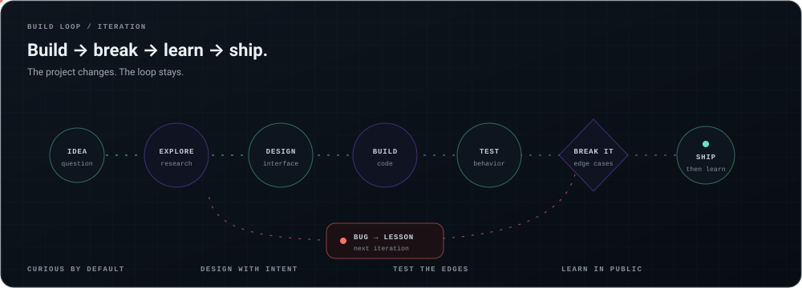

<!--
  SIGNAL LEDGER / SOURCE
  The interface below is built from repository-native SVG and deterministic data.
  Motion respects prefers-reduced-motion. No tracking pixels or third-party stat cards.
-->

<p align="center">
  <a href="https://metehanulusoy.github.io"><strong>PORTFOLIO ↗</strong></a>
  &nbsp;&nbsp;·&nbsp;&nbsp;
  <a href="https://www.linkedin.com/in/metehan-ulusoy-1806b6223"><strong>LINKEDIN ↗</strong></a>
  &nbsp;&nbsp;·&nbsp;&nbsp;
  <a href="mailto:ulusoy.metehan03@gmail.com"><strong>EMAIL ↗</strong></a>
</p>

<picture>
  <source media="(max-width: 600px)" srcset="assets/hero-mobile.svg">
  
</picture>

<p align="center">
  <sub>COMPUTER ENGINEERING · TÜRKİYE · BUILDING IN PUBLIC</sub>
</p>


## 00 / About

**Building things, breaking things, learning in public. AI, software & side projects.**

I’m a Computer Engineering student who enjoys moving between software engineering, web experiences, AI/ML and automation. I don’t want one label to decide what I can build; I follow the problem, choose the tools and learn by shipping.

`software engineering` · `web + interaction` · `AI / ML` · `automation` · `side projects`


## 01 / Live signal

<picture>
  <source media="(max-width: 600px)" srcset="https://raw.githubusercontent.com/metehanulusoy/metehanulusoy/output/terminal-card-mobile.svg">
  
</picture>

<sub>Generated daily from GitHub’s API by a deterministic workflow. If the API is unavailable, the last valid snapshot stays online.</sub>


## 02 / Selected builds

Four projects, four different kinds of problem.

<picture>
  <source media="(max-width: 600px)" srcset="assets/projects/metehanulusoy.github.io-mobile.svg">
  
</picture>
<p align="right"><a href="https://github.com/metehanulusoy/metehanulusoy.github.io"><sub><strong>OPEN REPOSITORY ↗</strong></sub></a></p>

<picture>
  <source media="(max-width: 600px)" srcset="assets/projects/myanimelist-mobile.svg">
  
</picture>
<p align="right"><a href="https://github.com/metehanulusoy/myanimelist"><sub><strong>OPEN REPOSITORY ↗</strong></sub></a></p>

<picture>
  <source media="(max-width: 600px)" srcset="assets/projects/semantic-caching-mobile.svg">
  
</picture>
<p align="right"><a href="https://github.com/metehanulusoy/semantic-caching"><sub><strong>OPEN REPOSITORY ↗</strong></sub></a></p>

<picture>
  <source media="(max-width: 600px)" srcset="assets/projects/price-tracker-bot-mobile.svg">
  
</picture>
<p align="right"><a href="https://github.com/metehanulusoy/price-tracker-bot"><sub><strong>OPEN REPOSITORY ↗</strong></sub></a></p>

<p align="right"><a href="https://github.com/metehanulusoy?tab=repositories"><strong>EXPLORE ALL REPOSITORIES →</strong></a></p>


## 03 / The build loop

<picture>
  <source media="(max-width: 600px)" srcset="assets/system-map-mobile.svg">
  
</picture>

The path is rarely linear. A failed test, awkward interface or wrong assumption is useful input for the next version.


## 04 / What I explore

- **Software engineering** — APIs, backend services, data flows and production-shaped systems.
- **Web & interaction** — full-stack products, motion, responsive interfaces and creative frontend work.
- **AI & machine learning** — retrieval, evaluation, model routing, computer vision and explainable ML.
- **Tools & automation** — bots, workflow conversion, developer utilities and experiments that remove repetition.

**Languages and tools I reach for:**<br>
`Python` · `TypeScript` · `JavaScript` · `FastAPI` · `Next.js` · `Supabase` · `Docker` · `GitHub Actions` · `scikit-learn` · `GSAP`

<details>
<summary><strong>Project archive / more things I’ve built</strong></summary>

### Web & product

- [AnimeVerse](https://github.com/metehanulusoy/myanimelist) — social anime discovery and tracking with Next.js + Supabase
- [Motion Portfolio](https://github.com/metehanulusoy/metehanulusoy.github.io) — Lenis, GSAP and WebGL portfolio experience
- [Portfolio + technical blog](https://github.com/metehanulusoy/metehanulusoy.dev) — bilingual Next.js, Tailwind and MDX project

### AI systems

- [Semantic Caching](https://github.com/metehanulusoy/semantic-caching) — streaming-aware, OpenAI-compatible cache proxy
- [Hybrid Search RAG](https://github.com/metehanulusoy/rag-hybrid-search) — dense + BM25 retrieval, reranking and citation verification
- [LLM Cost Autopilot](https://github.com/metehanulusoy/llm-cost-autopilot) — quality-aware multi-provider model routing
- [Model Regression Detection](https://github.com/metehanulusoy/model-regression-detection) — evaluation gates for model and prompt changes
- [Failure Forensics](https://github.com/metehanulusoy/failure-forensics) — trace-first root-cause analysis for AI pipelines
- [Self-Healing Docs](https://github.com/metehanulusoy/self-healing-docs) — code-to-doc link graph and documentation drift repair
- [LLM Arbitration](https://github.com/metehanulusoy/llm-arbitration) — multi-agent evaluation and confidence-aware adjudication
- [Jarvis](https://github.com/metehanulusoy/jarvis) — privacy-focused local assistant powered by Ollama

### Data, ML & FinTech

- [BIST AI Investment Assistant](https://github.com/metehanulusoy/bist-ai-yatirim-asistani) — portfolio analysis and paper trading
- [Credit Risk Scoring](https://github.com/metehanulusoy/credit-risk-scoring) — XGBoost, SHAP and banking metrics
- [Fraud Detection System](https://github.com/metehanulusoy/fraud-detection-system) — ensemble model with rule-based alerts
- [Banking Chatbot RAG](https://github.com/metehanulusoy/banking-chatbot-rag) — Turkish banking FAQ assistant with guardrails
- [Garbage Classifier](https://github.com/metehanulusoy/garbage-classifier) — browser-based image classification with MobileNet

### Tools & automation

- [Price Tracker Bot](https://github.com/metehanulusoy/price-tracker-bot) — product monitoring, charts and Telegram alerts
- [n8n Workflow to Python](https://github.com/metehanulusoy/n8n-workflow-to-python) — browser-based workflow conversion
- [Claude Recipes](https://github.com/metehanulusoy/claude-recipes) — documented skills, agents, hooks and MCP configurations
- [Awesome n8n Workflows](https://github.com/metehanulusoy/awesome-n8n-workflows) — searchable automation workflow collection

</details>


## 05 / Engineering defaults

```text
01  Start with the problem, not the fashionable tool.
02  Keep the architecture as simple as the constraints allow.
03  Test failure-prone paths and make errors observable.
04  Design for real screens, keyboard users and reduced motion.
05  Document decisions, trade-offs and the next honest improvement.
06  Ship, listen, revise.
```

## Open channel

I’m open to learning, collaborating and software / AI internship opportunities. If you’re building something thoughtful—or just want to compare notes—say hello.

<p align="center">
  <a href="mailto:ulusoy.metehan03@gmail.com"><strong>EMAIL ME</strong></a>
  &nbsp;&nbsp;·&nbsp;&nbsp;
  <a href="https://www.linkedin.com/in/metehan-ulusoy-1806b6223"><strong>CONNECT ON LINKEDIN</strong></a>
</p>


<p align="center"><sub>Designed and built as repository-native SVG · no profile-view trackers · motion respects reduced-motion preferences</sub></p>
