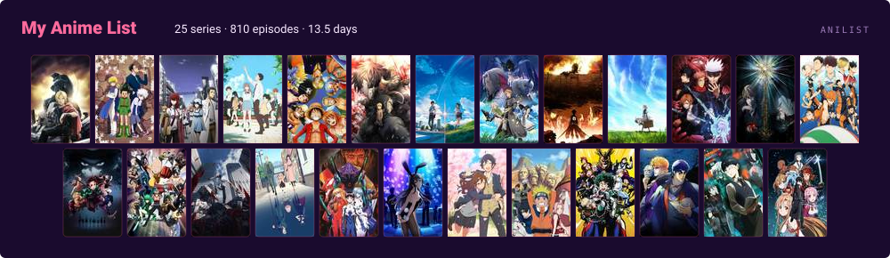

<!--
  Synthwave Sunset — Perspektif ızgara üstünde doğan güneş · her blok arası dalga, terminal yok

  Palette: bg #1a0b2e · ink #f7e8ff · accents #FF6B9D #FEC868 #C56CF0 #FF9E64

  No repository cards, contribution calendar, activity feed or contact row:
  GitHub renders every one of those outside this README already.
  The now-playing card uses theme=spotify-embed with mode=dark. `mode` is not in the
  service's documented parameter list but view.py reads it, and the embed template is
  the only one that branches on it — every other theme takes background_color instead,
  which this template hardcodes to white. It is the one way to get this shape without
  a white panel. bar_color does not reach the embed's progress bar; that stays Spotify
  green.

  The views counter is laobi rather than komarev: GitHub's camo proxy gets a hard 503
  from komarev.com on every request, so that badge only ever rendered as a broken
  image. laobi wants its colours URL-encoded with %23 — handed a bare hex it emits
  fill="1a0b2e", which is not a valid colour, and the badge silently falls back to black.

  The raster budget in validate_assets.py is deliberately kept even though no
  raster asset ships right now: the city GIF that prompted it is gone, but the
  ceiling is what stops the next unoptimised drop-in.

  The AniList panel is drawn by scripts/build_anilist_card.py rather than pulled
  from img.anili.st. That service reads User.statistics, and on this account the
  aggregate is stuck at zero — 25 completed entries with progress on 24 of them,
  and count/episodesWatched/minutesWatched have all reported 0 for over eight
  hours. MediaListCollection returns the real rows, so the panel counts those.

  The covers are embedded as base64 JPEGs, not linked: an SVG inside the 
  GitHub renders it in is its own document and browsers block its outbound
  requests, so s4.anilist.co URLs would draw an empty grid. Thumbnail size and
  JPEG quality are set to keep the file under the 120 KB ceiling.

  Every animation rests in a readable state under prefers-reduced-motion and
  none uses <script>, which never runs inside the  GitHub renders these in.
-->

  

  
  
  
  
  
  
  
  

  
  

  

