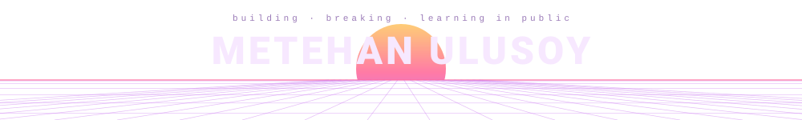

<!--
  Synthwave Sunset — Perspektif ızgara üstünde doğan güneş · her blok arası dalga, terminal yok

  Palette: bg #1a0b2e · ink #f7e8ff · accents #FF6B9D #FEC868 #C56CF0 #FF9E64

  No repository cards, contribution calendar, activity feed or contact row:
  GitHub renders every one of those outside this README already.
  Every animation rests in a readable state under prefers-reduced-motion and
  none uses <script>, which never runs inside the  GitHub renders these in.
-->

  

  
  
  
  
  
  
  
  

  
  

