<!--
  DEV ARCADE / SOURCE
  Hand-written SVG scenes live in assets/ and are rendered straight from this repo.
  The live panels (terminal, contribution grid, 3D calendar) are generated by GitHub
  Actions and published to this repository's `output` branch — so nothing here depends
  on a third-party card host staying alive.
  Every animated asset supports prefers-reduced-motion and light/dark themes.
-->

<picture>
  <source media="(max-width: 600px)" srcset="assets/arcade/nameplate-mobile-v1.svg">
  
</picture>

<p align="center"><code>PRESS START&nbsp; / &nbsp;PICK A PROBLEM&nbsp; / &nbsp;BUILD THE NEXT VERSION</code></p>

## 00 / Player log

**Building things, breaking things, learning in public. AI, software & side projects.**

I’m a Computer Engineering student who likes owning the whole build loop—from shaping an idea and designing the interaction to writing the software, connecting AI when it fits, and automating the repetitive parts. I follow the problem, choose the tools, and learn by shipping.

```ts
const metehan = {
  class: "generalist builder",
  quests: ["software", "web + design", "AI / ML", "automation"],
  loop: ["idea", "build", "break", "learn", "ship"],
  status: "ready for the next hard problem"
};
```


## 01 / Live terminal


<sub>Rebuilt daily from GitHub’s API by a workflow in this repository and published to the <code>output</code> branch.</sub>

## 02 / Bug hunt

<picture>
  <source media="(max-width: 600px)" srcset="assets/arcade/bug-hunt-mobile-v1.svg">
  
</picture>

The loop is rarely clean—and that is the fun part. A failed test, awkward interface or wrong assumption becomes XP for the next version.


## 03 / Quest select

Six builds, six different kinds of problem. Choose a quest to inspect the source.

<picture>
  <source media="(max-width: 600px)" srcset="assets/arcade/projects/metehanulusoy.github.io-quest-mobile-v1.svg">
  
</picture>
<p align="right"><a href="https://github.com/metehanulusoy/metehanulusoy.github.io"><strong>▶ OPEN QUEST / SOURCE ↗</strong></a></p>

<picture>
  <source media="(max-width: 600px)" srcset="assets/arcade/projects/myanimelist-quest-mobile-v1.svg">
  
</picture>
<p align="right"><a href="https://github.com/metehanulusoy/myanimelist"><strong>▶ OPEN QUEST / SOURCE ↗</strong></a></p>

<picture>
  <source media="(max-width: 600px)" srcset="assets/arcade/projects/semantic-caching-quest-mobile-v1.svg">
  
</picture>
<p align="right"><a href="https://github.com/metehanulusoy/semantic-caching"><strong>▶ OPEN QUEST / SOURCE ↗</strong></a></p>

<picture>
  <source media="(max-width: 600px)" srcset="assets/arcade/projects/price-tracker-bot-quest-mobile-v1.svg">
  
</picture>
<p align="right"><a href="https://github.com/metehanulusoy/price-tracker-bot"><strong>▶ OPEN QUEST / SOURCE ↗</strong></a></p>

<picture>
  <source media="(max-width: 600px)" srcset="assets/arcade/projects/rag-hybrid-search-quest-mobile-v1.svg">
  
</picture>
<p align="right"><a href="https://github.com/metehanulusoy/rag-hybrid-search"><strong>▶ OPEN QUEST / SOURCE ↗</strong></a></p>

<picture>
  <source media="(max-width: 600px)" srcset="assets/arcade/projects/n8n-workflow-to-python-quest-mobile-v1.svg">
  
</picture>
<p align="right"><a href="https://github.com/metehanulusoy/n8n-workflow-to-python"><strong>▶ OPEN QUEST / SOURCE ↗</strong></a></p>

<p align="center"><a href="https://github.com/metehanulusoy?tab=repositories"><strong>🗺️ EXPLORE THE FULL QUEST MAP →</strong></a></p>


## 04 / Skill tree

<picture>
  <source media="(max-width: 600px)" srcset="assets/arcade/skill-tree-mobile-v1.svg">
  
</picture>

<p align="center">
  
</p>

**Tools are loadouts, not labels.** I pick what fits the quest.

<details>
<summary><strong>🎒 Open inventory / more things I’ve built</strong></summary>

### Web & product

- [AnimeVerse](https://github.com/metehanulusoy/myanimelist) — social anime discovery and tracking with Next.js + Supabase
- [Motion Portfolio](https://github.com/metehanulusoy/metehanulusoy.github.io) — Lenis, GSAP and WebGL portfolio experience
- [Portfolio + technical blog](https://github.com/metehanulusoy/metehanulusoy.dev) — bilingual Next.js, Tailwind and MDX project

### Software & AI systems

- [Semantic Caching](https://github.com/metehanulusoy/semantic-caching) — streaming-aware, OpenAI-compatible cache proxy
- [Hybrid Search RAG](https://github.com/metehanulusoy/rag-hybrid-search) — dense + BM25 retrieval, reranking and citation verification
- [LLM Cost Autopilot](https://github.com/metehanulusoy/llm-cost-autopilot) — quality-aware multi-provider model routing
- [Model Regression Detection](https://github.com/metehanulusoy/model-regression-detection) — evaluation gates for model and prompt changes
- [Failure Forensics](https://github.com/metehanulusoy/failure-forensics) — trace-first root-cause analysis for AI pipelines
- [Jarvis](https://github.com/metehanulusoy/jarvis) — privacy-focused local assistant powered by Ollama

### Data, ML & FinTech

- [BIST AI Investment Assistant](https://github.com/metehanulusoy/bist-ai-yatirim-asistani) — portfolio analysis and paper trading
- [Credit Risk Scoring](https://github.com/metehanulusoy/credit-risk-scoring) — XGBoost, SHAP and banking metrics
- [Fraud Detection System](https://github.com/metehanulusoy/fraud-detection-system) — ensemble model with rule-based alerts
- [Garbage Classifier](https://github.com/metehanulusoy/garbage-classifier) — browser-based image classification with MobileNet

### Tools & automation

- [Price Tracker Bot](https://github.com/metehanulusoy/price-tracker-bot) — product monitoring, charts and Telegram alerts
- [n8n Workflow to Python](https://github.com/metehanulusoy/n8n-workflow-to-python) — browser-based workflow conversion
- [Claude Recipes](https://github.com/metehanulusoy/claude-recipes) — documented skills, agents, hooks and MCP configurations
- [Awesome n8n Workflows](https://github.com/metehanulusoy/awesome-n8n-workflows) — searchable automation workflow collection

</details>


## 05 / Contribution grid

A year of commits, played as a level.

<picture>
  <source media="(prefers-color-scheme: dark)" srcset="https://raw.githubusercontent.com/metehanulusoy/metehanulusoy/output/bomberman-contribution-graph-dark.svg">
  <source media="(prefers-color-scheme: light)" srcset="https://raw.githubusercontent.com/metehanulusoy/metehanulusoy/output/bomberman-contribution-graph.svg">
  
</picture>

...and the same year, stacked.


<!--
  06 / NOW PLAYING — reserved.

  Needs a one-time setup that only the account owner can do (Spotify OAuth):
    1. Open https://spotify-github-profile.kittinanx.com and sign in with Spotify.
    2. Pick a card style (default / compact / natemoo-re / novatorem / karaoke).
    3. Copy the generated URL — it contains your uid.
    4. Replace the src below with it and delete these comment markers.

  <h2>06 / Now playing</h2>
  <p align="center">
    <a href="https://open.spotify.com/user/YOUR_SPOTIFY_ID">
      
    </a>
  </p>

  Note: unlike every other panel here, this one is served by a third-party host,
  so it goes dark if that host does. A self-hosted alternative is the `music`
  plugin of lowlighter/metrics, which also needs a Spotify token but writes the
  SVG into this repository instead.
-->


## 06 / Co-op mode

Useful idea, weird prototype or hard problem? Send a signal.

<p align="center">
  <a href="https://metehanulusoy.github.io"><strong>PORTFOLIO ↗</strong></a>
  &nbsp;&nbsp;·&nbsp;&nbsp;
  <a href="https://www.linkedin.com/in/metehan-ulusoy-1806b6223"><strong>LINKEDIN ↗</strong></a>
  &nbsp;&nbsp;·&nbsp;&nbsp;
  <a href="mailto:ulusoy.metehan03@gmail.com"><strong>EMAIL ↗</strong></a>
</p>


<p align="center"><sub>Hand-written SVG scenes · live panels generated in-repo and served from the <code>output</code> branch · no profile-view trackers · motion respects reduced-motion preferences</sub></p>
