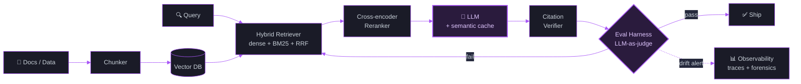

<!--
  ██╗   ██╗██╗     ██╗   ██╗███████╗ ██████╗ ██╗   ██╗
  ██║   ██║██║     ██║   ██║██╔════╝██╔═══██╗╚██╗ ██╔╝
  ██║   ██║██║     ██║   ██║███████╗██║   ██║ ╚████╔╝
  ██║   ██║██║     ██║   ██║╚════██║██║   ██║  ╚██╔╝
  ╚██████╔╝███████╗╚██████╔╝███████║╚██████╔╝   ██║
   ╚═════╝ ╚══════╝ ╚═════╝ ╚══════╝ ╚═════╝    ╚═╝
  You found the source. Nice instinct.
  If you are a human: everything animated on this page is hand-built SVG — view any asset in /assets.
-->


<p align="center">
  <a href="https://www.linkedin.com/in/metehan-ulusoy-1806b6223"></a>
  <a href="mailto:ulusoy.metehan03@gmail.com"></a>
  
  
  
</p>

<p align="center">
  
</p>


### About me

- 🎯 Building **production-grade AI systems** — LLM gateways, RAG pipelines, eval harnesses, multi-agent orchestration
- 🏦 Domain focus on **Banking & FinTech** — credit risk, fraud detection, compliance-aware chatbots
- 🧠 **15-project AI Engineering portfolio** in progress: type-safe Python, mypy strict, ≥80 % test coverage on every repo
- 🤖 This profile is partially **maintained by an AI pipeline** — the status line above is written daily by an LLM reading my commit activity, and every animation here is hand-built SVG living in [`/assets`](./assets)
- ✉️ Open to AI Engineer roles (remote / EU / Turkey) — `ulusoy.metehan03@gmail.com`

> [!TIP]
> ✅ **Just shipped:** Project 06 — [Hybrid-Search RAG Pipeline](https://github.com/metehanulusoy/rag-hybrid-search) (dense + BM25 + RRF fusion + cross-encoder rerank + citation verification).
> 🚧 **Now building:** Project 07 of 15 — [semantic caching layer](https://github.com/metehanulusoy/semantic-caching) (embedding-similarity response cache + TTL + cache-quality eval). Star the profile to follow new releases.

<table width="100%">
<tr>
<td width="50%" align="center" valign="top">
  
</td>
<td width="50%" align="center" valign="top">
  <br/>
  
</td>
</tr>
</table>


### 🏆 Featured work

<p align="center">
  <a href="https://github.com/metehanulusoy/llm-cost-autopilot">
    
  </a>
  <a href="https://github.com/metehanulusoy/failure-forensics">
    
  </a>
</p>
<p align="center">
  <a href="https://github.com/metehanulusoy/llm-arbitration">
    
  </a>
  <a href="https://github.com/metehanulusoy/self-healing-docs">
    
  </a>
</p>

### AI Engineering Portfolio &nbsp;<sub>15-project series</sub>

> Each repo: production-shaped Python, FastAPI / Click CLI / GitHub Action, Pydantic v2, mypy strict, ruff lint, ≥ 80 % pytest coverage, Dockerfile, ADRs, MIT license. No real network calls in tests.

| # | Project | What it does | Stack |
|---|---|---|---|
| 01 | [model-regression-detection](https://github.com/metehanulusoy/model-regression-detection) | CI/CD-style regression gate for LLM features. Async eval runner + LLM-as-judge + 7-run drift, PR comment bot, merge-block on critical regressions. | Python · Pydantic · OpenAI · GitHub Actions |
| 02 | [llm-cost-autopilot](https://github.com/metehanulusoy/llm-cost-autopilot) | Multi-provider LLM gateway. sklearn complexity classifier routes each request to the cheapest acceptable model; async LLM-as-judge sampler verifies quality. **>50 % cost reduction vs all-gpt-4o.** | FastAPI · scikit-learn · OpenAI · Anthropic · Ollama |
| 03 | [failure-forensics](https://github.com/metehanulusoy/failure-forensics) | Observability + auto root-cause analysis for multi-step AI pipelines. Decorator-based span tracing, parallel LLM-as-judge backward trace, atomic feedback-to-eval loop, Streamlit explorer. | FastAPI · OpenTelemetry · SQLite WAL · Streamlit |
| 04 | [self-healing-docs](https://github.com/metehanulusoy/self-healing-docs) | GitHub Action that detects when code changes made docs stale, then opens an auto-fix PR or flags affected sections for review. Embedding-based code-to-docs link graph + LLM staleness verifier + style-preservation pass. | GitHub Actions · OpenAI embeddings · PyGithub · unidiff |
| 05 | [llm-arbitration](https://github.com/metehanulusoy/llm-arbitration) | Multi-agent verdict synthesis. Three specialist critics on three different providers grade an output along distinct dimensions; pure disagreement detector + adjudicator agent produce a single confidence-scored verdict. | FastAPI · OpenAI · Anthropic · Ollama · LangGraph-style DAG |
| 06 | [rag-hybrid-search](https://github.com/metehanulusoy/rag-hybrid-search) | Production-grade RAG pipeline. Multi-format ingestion, dense + BM25 retrieval with reciprocal-rank fusion, cross-encoder rerank, citation verification, and a retrieval-quality eval set. | FastAPI · sentence-transformers · BM25 · Docker |

> 07–15 in progress: semantic caching, text-to-SQL with guardrails, prompt A/B testing, LoRA fine-tuning, LLM gateway with rate limiting, AI feature flags, eval-set generators, multi-modal document processing, and an agent orchestration platform.

### 🧬 How I build AI systems




### Banking &amp; ML Projects

| Project | What it does | Tech |
|---|---|---|
| [credit-risk-scoring](https://github.com/metehanulusoy/credit-risk-scoring) | Credit default prediction with SHAP explainability and banking metrics (KS, Gini, PSI). | XGBoost · scikit-learn · SHAP · FastAPI |
| [fraud-detection-system](https://github.com/metehanulusoy/fraud-detection-system) | Real-time fraud detection — ML ensemble + rule-based alerts. | XGBoost · Isolation Forest · FastAPI |
| [banking-chatbot-rag](https://github.com/metehanulusoy/banking-chatbot-rag) | RAG chatbot for Turkish banking FAQs with guardrails &amp; compliance. | LangChain · ChromaDB · FastAPI |

<details>
<summary><b>📊 Credit risk model — evaluation snapshots</b></summary>

<br/>


</details>

<details>
<summary><b>🧰 Side projects &amp; experiments</b></summary>

<br/>

| Project | Description |
|---|---|
| [claude-recipes](https://github.com/metehanulusoy/claude-recipes) | Copy-paste-ready skills, subagents, hooks &amp; MCP configs for Claude Code — each one explained (EN/TR). |
| [pdf-rag-app](https://github.com/metehanulusoy/pdf-rag-app) | AI-powered PDF Q&amp;A system with RAG &amp; OpenAI. |
| [awesome-n8n-workflows](https://github.com/metehanulusoy/awesome-n8n-workflows) | 2 055 production-ready n8n automation templates. |
| [price-tracker-bot](https://github.com/metehanulusoy/price-tracker-bot) | Price tracking bot for Trendyol &amp; Amazon with Telegram alerts. |

</details>


### Tech I work with

<p align="center">
  
</p>

<p align="center">
  
  
  
  
  
  
  
  
  
  
</p>

### Engineering standards I default to

```diff
+ Type-safe Python (Pydantic v2 + mypy --strict on every repo)
+ ≥80% pytest coverage with httpx.MockTransport — no real network calls in CI
+ Conventional commits, ADRs ("Why" + "Trade-offs" + "Revisit if")
+ Async-first I/O (asyncio + httpx + tenacity exponential backoff)
+ Structured JSON logging (structlog) with stable event names
+ Dockerfile + docker-compose + Makefile + GitHub Actions matrix py3.11/3.12
- No untyped public APIs · No secrets in commits · No flaky tests
```


### 📈 The contribution observatory

<p align="center">
  <picture>
    <source media="(prefers-color-scheme: dark)" srcset="https://raw.githubusercontent.com/metehanulusoy/metehanulusoy/output/profile-3d-dark.svg" />
    <source media="(prefers-color-scheme: light)" srcset="https://raw.githubusercontent.com/metehanulusoy/metehanulusoy/output/profile-3d-light.svg" />
    
  </picture>
</p>

#### 🐍 Watch my contributions get eaten

<p align="center">
  <picture>
    <source media="(prefers-color-scheme: dark)" srcset="https://raw.githubusercontent.com/metehanulusoy/metehanulusoy/output/snake-dark.svg" />
    <source media="(prefers-color-scheme: light)" srcset="https://raw.githubusercontent.com/metehanulusoy/metehanulusoy/output/snake-light.svg" />
    
  </picture>
</p>

<p align="center">
  
</p>

### Connect

<p align="center">
  <a href="https://www.linkedin.com/in/metehan-ulusoy-1806b6223"></a>
  <a href="https://github.com/metehanulusoy"></a>
  <a href="mailto:ulusoy.metehan03@gmail.com"></a>
</p>


<p align="center"><sub>Every animation on this page is hand-built SVG — no templates. Profile partially maintained by an AI pipeline · co-built with <b>Claude</b></sub></p>
